# 🍞 Baker - Bakery Web Site & Admin Panel

Baker, pastane/fırın işletmeleri için geliştirilmiş ASP.NET Core tabanlı bir web uygulamasıdır. Proje iki ana bölümden oluşur:

- 🔌 `BakerApi`: Ürün, kategori, şef, servis, galeri, mesaj, abone ve site içeriklerini yöneten REST API.
- 🖥️ `BakerWebUI`: API'den veri tüketen MVC/Razor tabanlı vitrin sitesi ve admin paneli.

Uygulamanın vitrin tarafında ziyaretçiler ürünleri, hizmetleri, ekip üyelerini, referansları ve iletişim formunu görüntüleyebilir. Admin panelinde ise site içerikleri yönetilebilir; ürün, kategori, servis, şef, galeri, mesaj ve abone kayıtları üzerinde listeleme, ekleme, güncelleme ve silme işlemleri yapılabilir.

## 🛠️ Kullanılan Teknolojiler

- 🧠 ASP.NET Core MVC / Web API
- 🗃️ Entity Framework Core
- 💾 SQL Server
- 🧩 Razor View Components
- 📘 Swagger / Swashbuckle
- 🎨 Bootstrap tabanlı Baker teması
- 🟣 Purple Admin yönetim paneli teması

## 🚀 Temel Özellikler

- 📊 Ana sayfada dinamik ürün, kategori, şef ve referans sayıları
- 🛍️ Ürünlerin kategori ve fiyat bilgileriyle listelenmesi
- 📖 Hakkımızda, servisler, ekip, referanslar ve galeri bölümleri
- 📩 İletişim formu ile ziyaretçi mesajı gönderme
- 📧 Bülten aboneliği
- 📊 Admin dashboard üzerinde genel proje özeti
- ⚙️ Ürün, kategori, servis, servis detayı, şef, galeri, mesaj ve abone yönetimi
- 🔄 API üzerinden CRUD işlemleri

## 🗄️ Veritabanı

Proje Entity Framework Core ile SQL Server kullanır.

## 🔌 API Katmanı

`BakerApi` projesi uygulamanın veri sağlayıcı katmanıdır. Controllerlar veritabanındaki tabloları dış dünyaya REST endpointleri olarak açar.

Başlıca controllerlar:

- 📦 `ProductsController`: Ürün listeleme, ürün-kategori ilişkili listeleme, ürün sayısı, ekleme, güncelleme, silme
- 🗂️ `CategoryController`: Kategori listeleme, kategori sayısı, ekleme, güncelleme, silme
- 👨‍🍳 `ChefController`: Şef listeleme, şef sayısı, ekleme, güncelleme, silme
- 🛎️ `ServiceController`: Servisleri ve servis detaylarını listeleme
- 📄 `ServiceDetailController`: Servislere bağlı detay maddelerini yönetme
- 🖼️ `GalleryController`: Galeri görsellerini yönetme
- 💬 `ContactController`: Ziyaretçi mesajlarını alma ve yönetme
- 📧 `SubscribeController`: Bülten abonelerini yönetme
- ⭐ `TestimonialController`: Referans/yorum kayıtlarını yönetme
- 📖 `AboutController` ve `AboutDetailController`: Hakkımızda alanı ve detay maddelerini yönetme
- 📍 `AddressInfoController`: Adres ve iletişim bilgilerini yönetme

## 🖥️ Web UI Katmanı

`BakerWebUI`, MVC yapısında hazırlanmıştır. Vitrin sayfası `DefaultController` ve View Component yapılarıyla oluşturulur. Admin tarafında ise her yönetim alanı için ayrı controller bulunur.

Önemli View Componentler:

- 🧭 `_DefaultNavbarComponentPartial`: Site navigasyonu
- 🌟 `_DefaultFeatureComponentPartial`: Hero alanı
- 📊 `_DefaultStatisticComponentPartial`: Ürün, şef, kategori ve referans sayıları
- 📖 `_DefaultAboutComponentPartial`: Hakkımızda bölümü
- 🛍️ `_DefaultProductComponentPartial`: Ürün kartları
- 🛎️ `_DefaultServiceComponentPartial`: Servisler bölümü
- 👨‍🍳 `_DefaultChefComponentPartial`: Ekip/şef bölümü
- 💬 `_DefaultTestimonialComponentPartial`: Referanslar bölümü
- 🔚 `_DefaultFooterComponentPartial`: Footer ve galeri
---
## Ekran Görüntüleri ve Açıklamalar

### 1. Ana Sayfa Hero Alanı

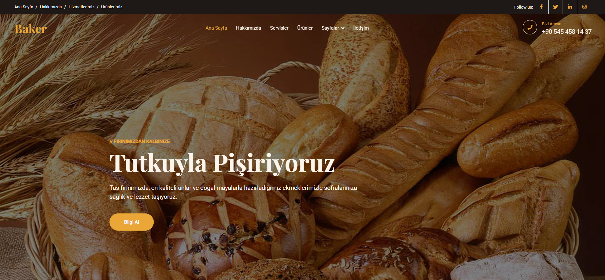

Ziyaretçinin siteye ilk girdiğinde gördüğü karşılama alanıdır. Üst menü, sosyal medya bağlantıları, telefon bilgisi ve marka başlığı burada yer alır. Hero görseli fırın temasını güçlendirir ve kullanıcıyı ana içeriklere yönlendirir.

### 2. İstatistik Alanı

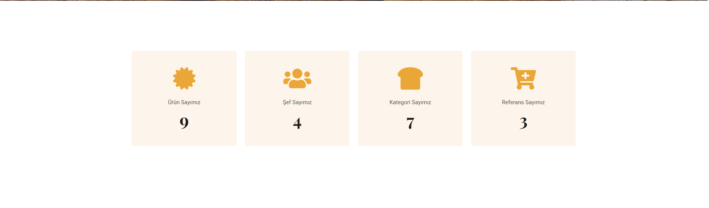

Bu bölüm API'den gelen dinamik sayıları gösterir. Ürün sayısı, şef sayısı, kategori sayısı ve referans sayısı ViewBag üzerinden çekilir. Böylece admin panelinde yapılan değişiklikler ana sayfadaki istatistiklere yansır.

### 3. Hakkımızda Bölümü

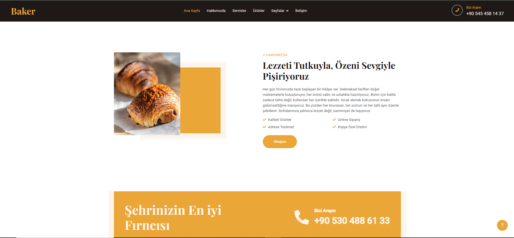

Pastanenin/fırının hakkımızda kısmını anlatan alandır. 

### 4. Ürünler Bölümü

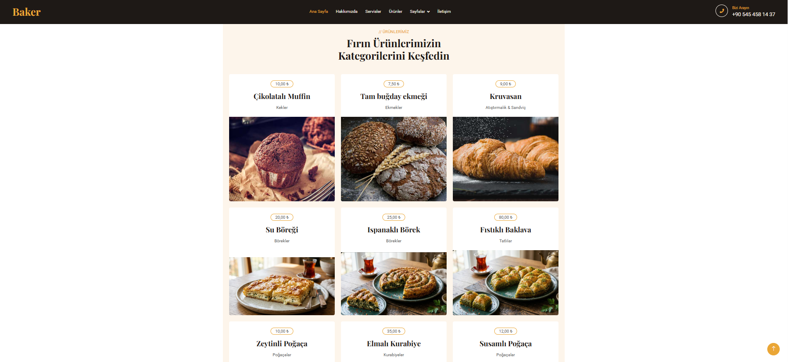

Ürünler kart yapısıyla listelenir. Her kartta ürün adı, fiyatı, kategori adı ve ürün görseli bulunur. 

### 5. Servisler Bölümü

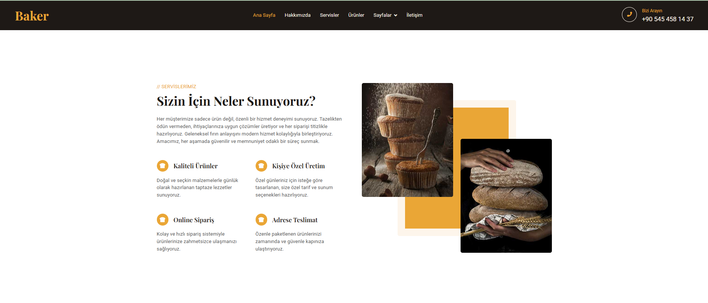

Fırının sunduğu hizmetleri açıklar. 

### 6. Ekip Bölümü

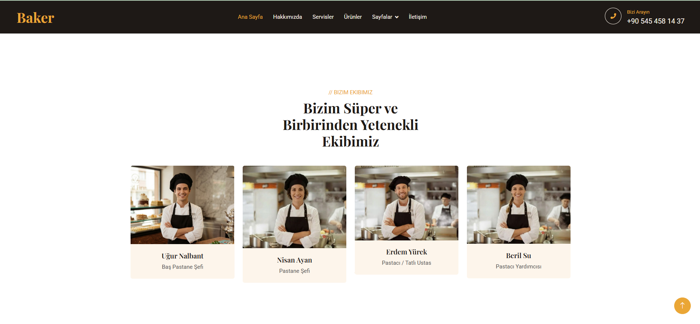

Şef ve çalışan bilgilerini gösterir. 

### 7. Referanslar ve Bülten Aboneliği

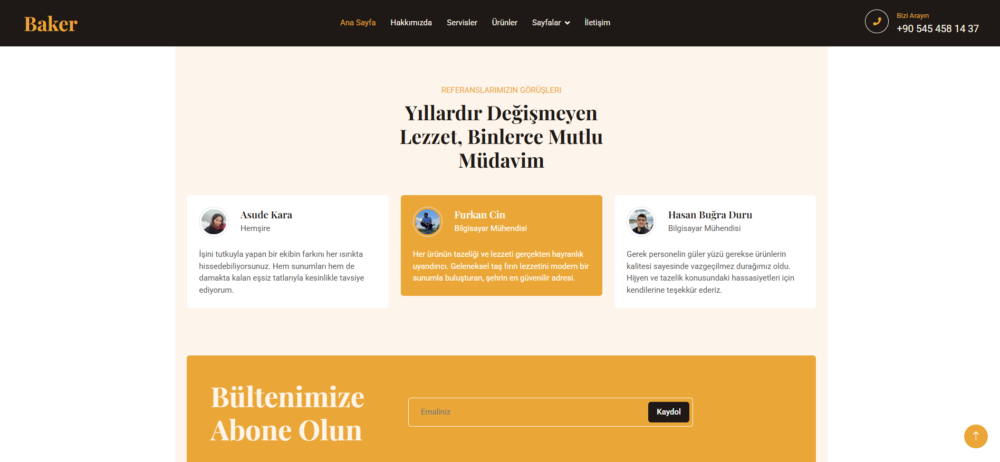

Müşteri yorumları ve bülten aboneliği formu burada bulunur.

### 8. Footer ve Galeri

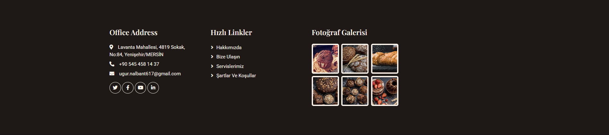

Footer alanında adres, telefon, e-posta, hızlı bağlantılar, sosyal medya ikonları ve fotoğraf galerisi yer alır. 
### 9. İletişim Formu

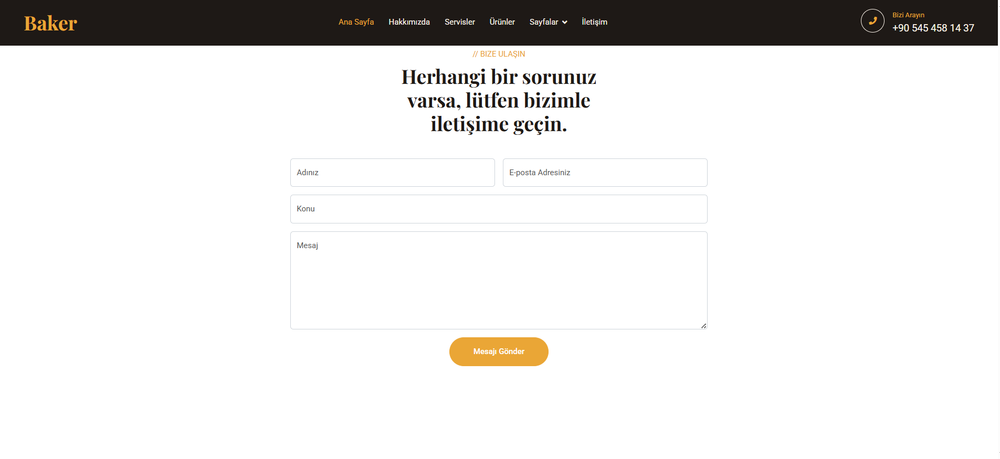

Ziyaretçiler ad, e-posta, konu ve mesaj bilgileriyle iletişim formu gönderebilir.

### 10. Başarılı Mesaj Bildirimi

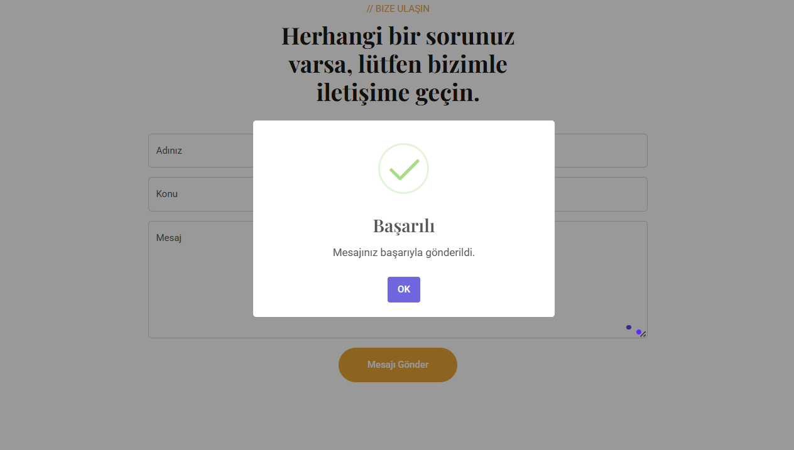

İletişim formu başarıyla gönderildiğinde kullanıcıya SweetAlert tarzında başarılı mesaj bildirimi gösterilir.

### 11. Admin Dashboard

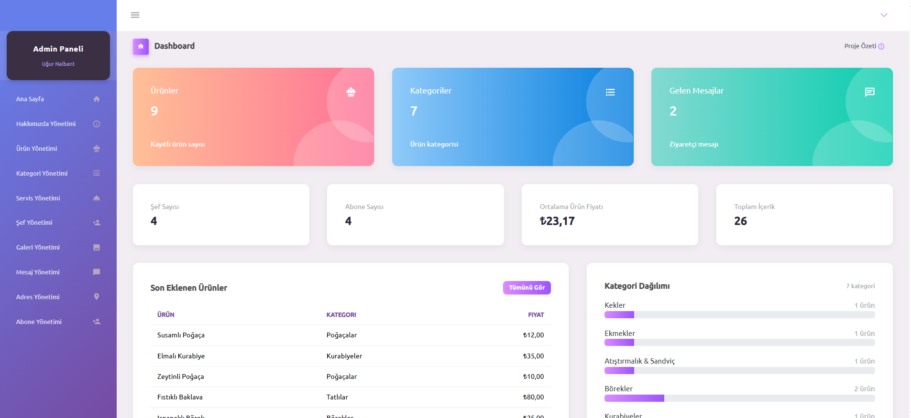

Admin panelinin ana ekranıdır. Ürün, kategori, mesaj, şef, abone ve toplam içerik sayıları gösterilir. Ayrıca son eklenen ürünler ve kategori dağılımı listelenir.

### 12. Hakkımızda Yönetimi

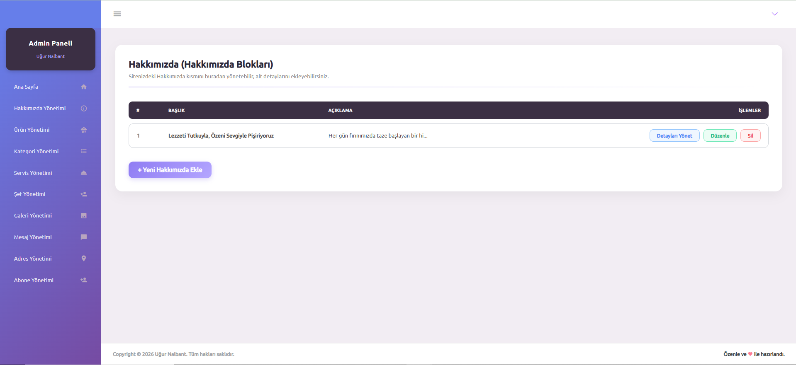

Ana sayfadaki hakkımızda içeriği buradan yönetilir. Başlık ve açıklama alanları listelenir; düzenleme, silme ve detay yönetimi yapılabilir.

### 13. Ürün Yönetimi

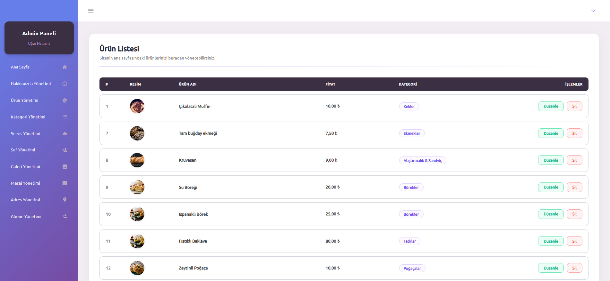

Admin, ürünleri görsel, ad, fiyat ve kategori bilgileriyle görüntüler. Ürünler düzenlenebilir veya silinebilir.

### 14. Ürün Güncelleme

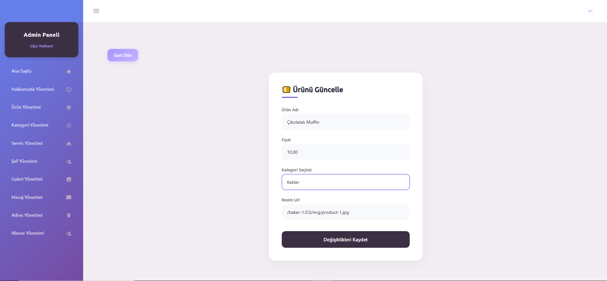

Var olan ürünün adı, fiyatı, kategorisi ve görsel URL bilgisi güncellenir. Kategori seçimleri API'den çekilir.

### 15. Yeni Ürün Kaydı

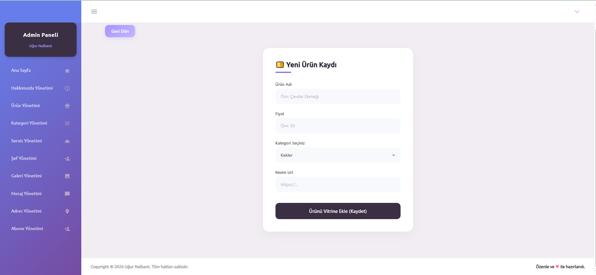

Yeni ürün ekleme formudur. Ürün adı, fiyat, kategori ve görsel URL bilgileriyle kayıt yapılır.

### 16. Kategori Listesi

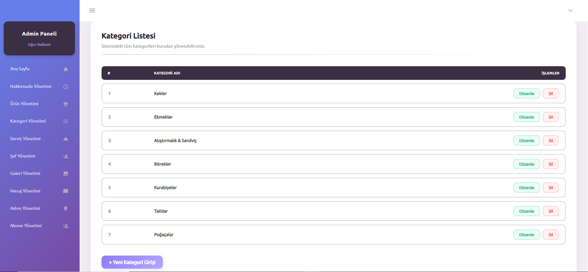

Ürün kategorileri listelenir. Kategoriler düzenlenebilir, silinebilir veya yeni kategori eklenebilir.

### 17. Kategori Güncelleme

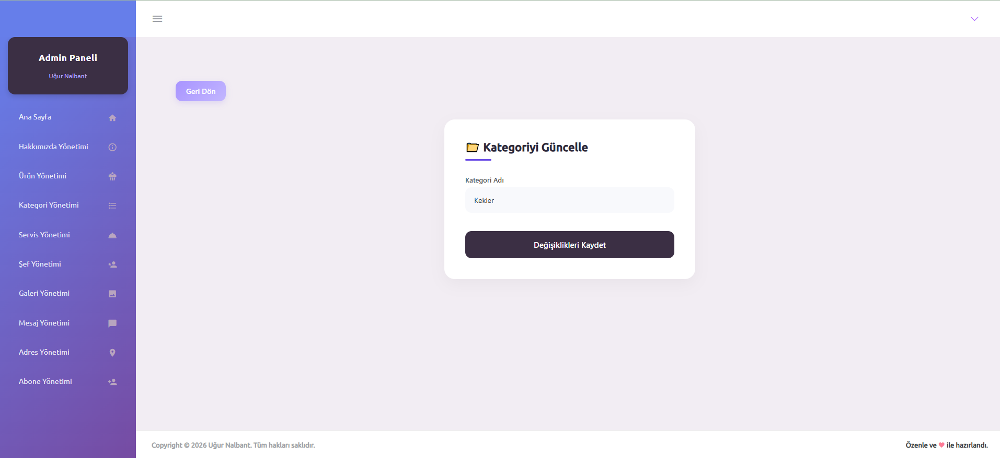

Seçilen kategorinin adı güncellenir. Güncelleme sonrası vitrin ve ürün kartlarındaki kategori bilgileri de değişir.

### 18. Yeni Kategori Kaydı

Yeni kategori ekleme formudur. Bu kategoriler ürün ekleme/güncelleme formlarında seçenek olarak kullanılır.

### 19. Servis Yönetimi

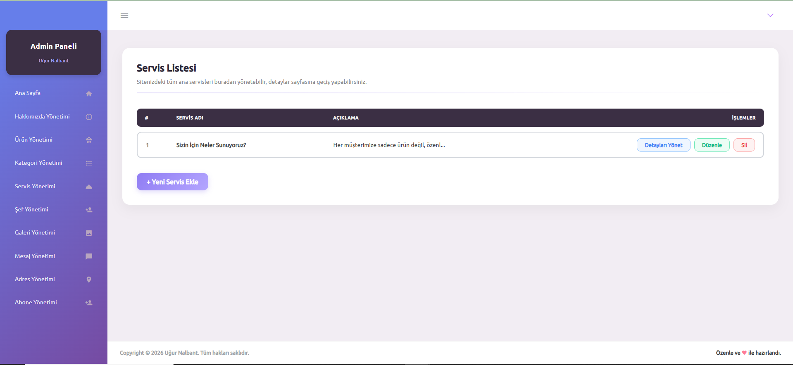

Ana servis başlıkları listelenir. Servisler düzenlenebilir, silinebilir ve detayları yönetilebilir.

### 20. Servis Güncelleme

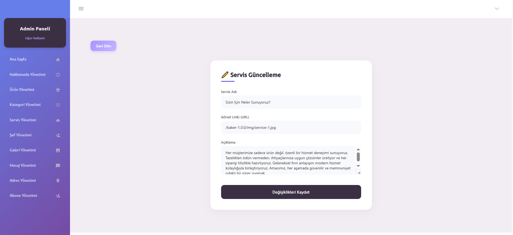

Servis adı, görsel bağlantısı ve açıklama metni güncellenir. Bu bilgiler ana sayfadaki servisler bölümüne yansır.

### 21. Yeni Servis Kaydı

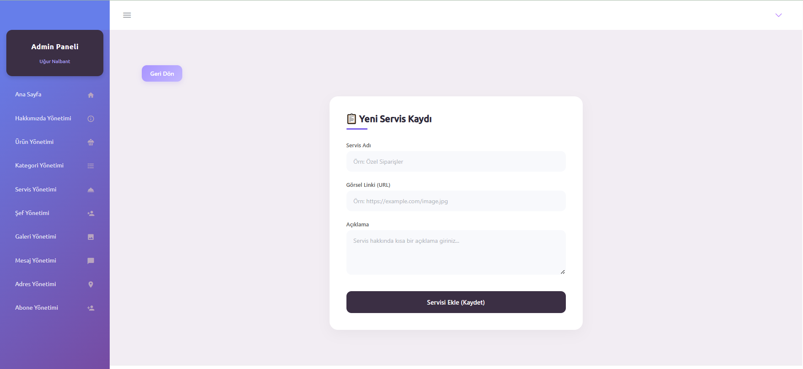

Yeni servis ekleme formudur. Servis adı, görsel URL ve açıklama bilgileri alınır.

### 22. Servis Detay Listesi

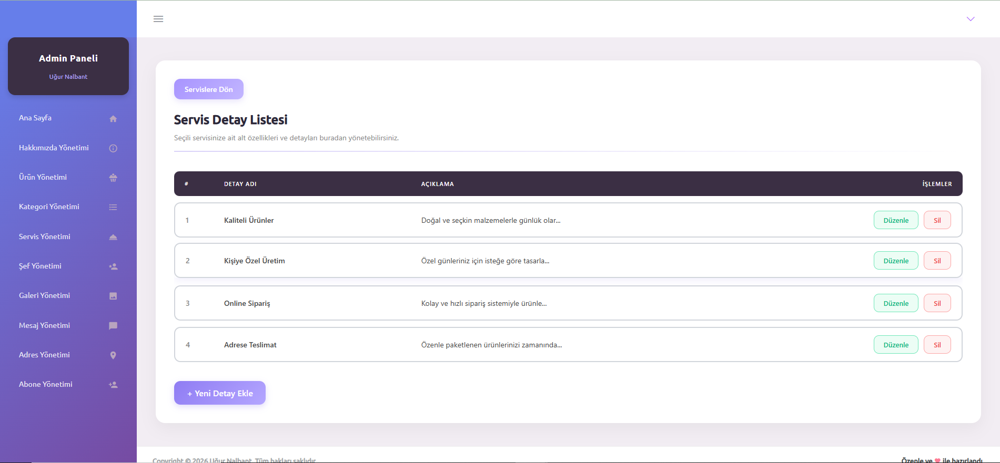

Seçili servise ait alt detaylar listelenir. Örneğin "Kaliteli Ürünler", "Kişiye Özel Üretim", "Online Sipariş" gibi maddeler bu bölümden yönetilir.

### 23. Şef Listesi

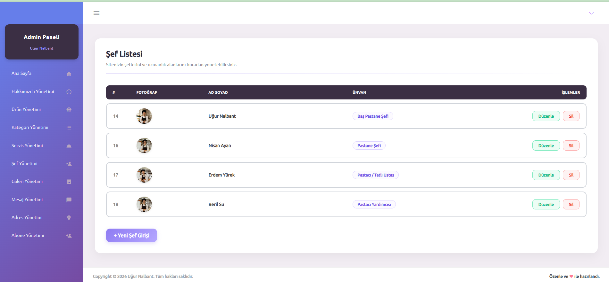

Sitede görünen ekip üyeleri listelenir. Fotoğraf, ad soyad ve unvan bilgileri bulunur.

### 24. Şef Güncelleme

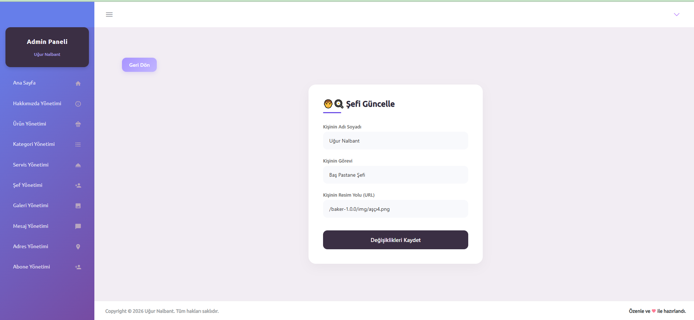

Var olan şef kaydının adı, görevi ve fotoğraf URL bilgisi güncellenir.

### 25. Yeni Şef Kaydı

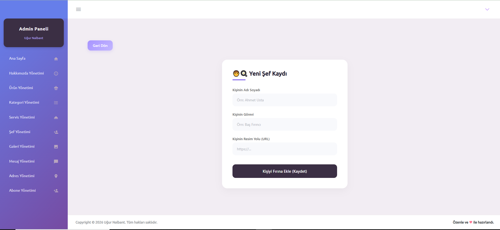

Yeni ekip üyesi ekleme formudur. Girilen kayıt ana sayfadaki ekip bölümünde görüntülenir.

### 26. Galeri Listesi

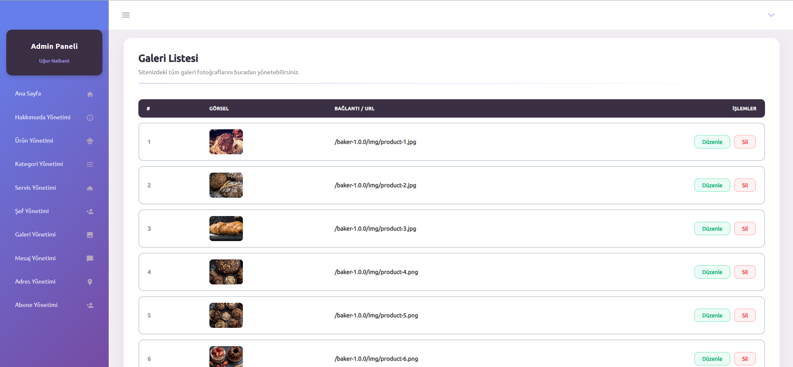

Footer ve galeri alanında kullanılan görseller listelenir. Görsel bağlantısı görüntülenir, düzenleme ve silme işlemleri yapılabilir.

### 27. Galeri Güncelleme

Kayıtlı galeri görselinin URL bilgisi güncellenir.

### 28. Yeni Galeri Kaydı

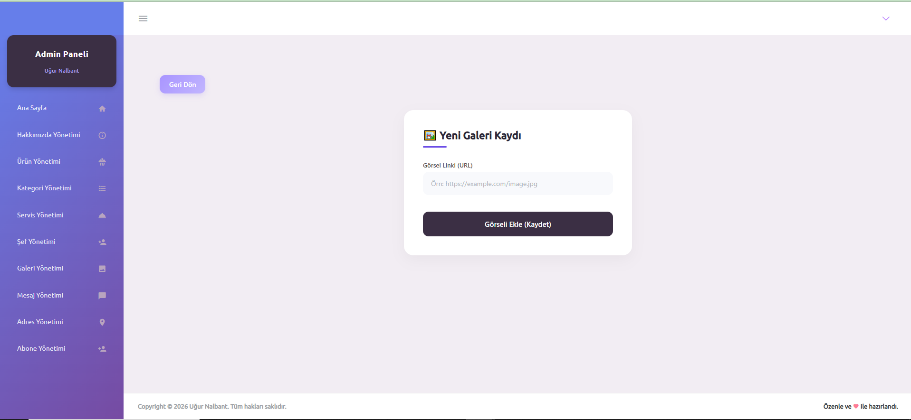

Yeni galeri görseli ekleme formudur. Eklenen görseller site footer galerisinde kullanılabilir.

### 29. Gelen Mesajlar

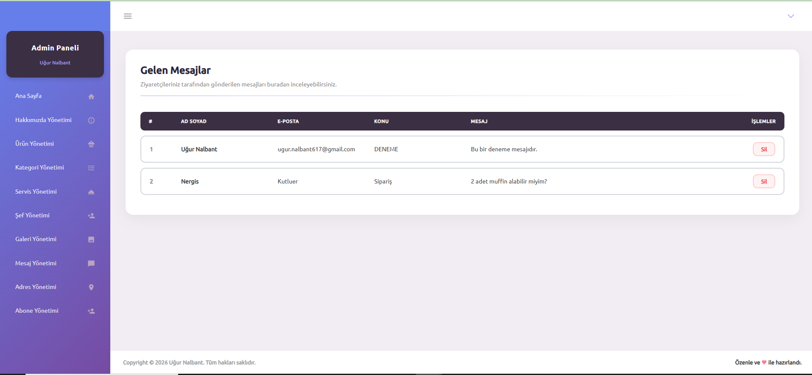

Ziyaretçilerin iletişim formundan gönderdiği mesajlar burada listelenir. Admin mesajları inceleyebilir ve silebilir.

### 30. Abone Yönetimi

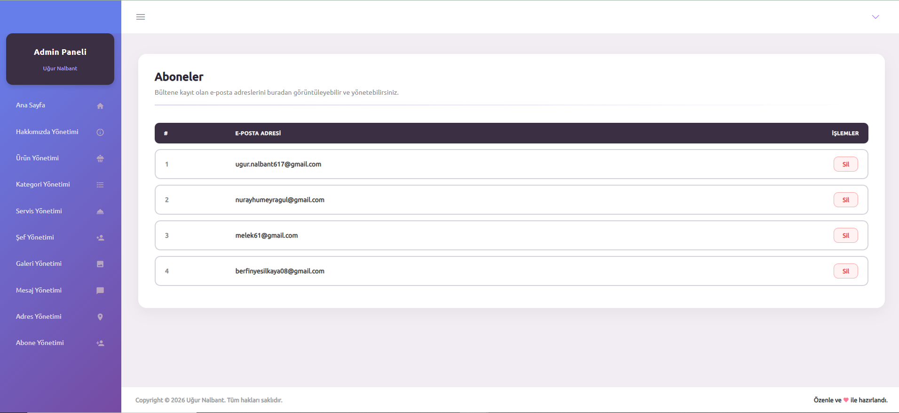

Bültene abone olan kullanıcıların e-posta adresleri listelenir. Admin gereksiz kayıtları silebilir.

